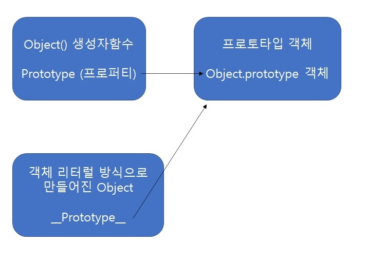
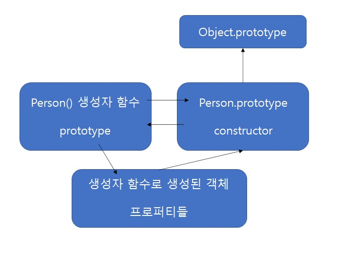

# 4장 함수와 프로토타입 체이닝

## 함수

특정기능을 제공하는 코드를 작성해서 함수를 정의하고, 이를 호출해서 결과값을 얻음.

하지만 JS의 함수는 모듈화 처리나 클로저 객체 생성 등 다양한 기능을 제공

JS 에서는 함수도 객체다.

### 함수의 정의

### `함수 리터럴 / 함수 선언문`

객체리터럴 방식으로 일반 객체를 생성하듯 함수 리터럴을 이용해 함수를 생성할 수 있다.

```
    function add(x,y){
        return x+y;
    };
```

- function 키워드 + 함수명 + 매개변수 리스트 로 선언

- 리터럴 방식은 함수명이 선택사항이며 함수명이 없는 함수를 익명함수 하고 함.

- 선언문으로 생성된 함수는 반드시 함수명이 정의되어야 함

- 매개변수에는 변수 타입을 기술하지 않음

### `함수 표현식`

JS 에서는 함수도 하나의 값으로 취급된다. ( = 일급객체 )

따라서 함수도 변수에 할당할 수 있다.

```
    var add = function (x,y){
        return x + y ;
    };

    var plus = add;

    console.log(add(3,4));      // 7
    console.log(plus(5,6));     // 11
```

익명함수 표현식으로 add 와 plus 변수는 두개의 인자를 더해서 반환하는 익명함수를 참조한다.

```
    var add = function sum(x,y){
        return x + y ;
    }

    console.log(add(3,4));      // 7
    console.log(sum(3,4));     // Error : sum is not defined
```

기명함수 표현식으로 add 가 sum 이라는 이름의 함수를 참조한다.

함수 표현식에서 사용된 함수 이름은 외부 코드에서 접근이 불가 하여

sum() 함수를 호출하면 정의되지 않은 함수라는 에러가 발생한다.

함수표현식의 함수 이름을 사용하면 함수 코드 내부에서 함수의 이름으로 함수의 재귀호출이 가능해진다.

```
    var factorialVar = function favtorial(n){
        if( n <= 1 ){
            return 1;
        }
        return n * factorial( n - 1 );
    };
```

### `Function 생성자`

```
new Function (arg1,arg2,arg3,...,argN, functionBody)
```

함수 선언문이나 표현식 방식도 결국은 내부적으로 Function 생성자 함수로 함수가 생성된다.

### 함수 호이스팅

함수 선언문 형태로 정의한 함수의 유효범위는 코드의 맨 처음부터 시작함

하지만 함수표현식 형태로 정의된 함수는 호이스팅이 일어나지 않는다.

> JS의 변수생성과 초기화의 작업이 분리되서 진행되기 때문

### 함수 객체

JS의 함수는 객체이기 때문에 일반 객체처럼 취급될 수 있으며 다음과 같은 동작이 가능하다.

- 리터럴에 의해 생성
- 변수나 배열이 요소, 객체의 프로퍼티 등에 할당 가능
- 함수의 인자로 전달가능
- 함수의 리턴값으로 리턴가능
- 동적으로 프로퍼티를 생성 및 할당 가능

### `일급객체`

https://ko.wikipedia.org/wiki/%EC%9D%BC%EA%B8%89_%EA%B0%9D%EC%B2%B4

JS 에서는 함수를 일급객체 라고 부른다.

위의 기능이 가능한 객체를 일급객체라고 하며  
 함수가 가지는 일급객체의 특성으로 인해 함수형 프로그래밍이 가능하다.

### `함수 객체의 기본 프로퍼티`

- name : 함수의 이름
- argument : 함수 호출시 절달된 인자 값

  > #### argument 객체
  >
  > 함수 호출시 호출된 함수의 내부로 인자값과 함께 전달되며  
  > argument 프로퍼티와 유사하게 함수로 호출할 때 인자값의 정보를 제공해준다.

- caller : 자신을 호출한 함수

- length : 함수가 정상적으로 실행될 때 기대되는 인자의 개수

- \_\_proto\_\_ : Function.prototype

> #### Function.prototype
>
> 모든 함수들의 부모 역할을 하는 프로토타입 객체  
> Empty ( ) 함수라고 명하기도 함
>
> - constructor
> - toString ( ) 메소드
> - apply ( thisArg , argArray ) 메소드
> - call ( thisArg, [, arg1[, arg2]]) 메소드
> - bind ( thisArg, [, arg1[, arg2]]) 메소드

- prototype : 함수가 생성될때 만들어지며, constuctor 하나만 있는 객체를 가리킴

### 함수의 형태

### `콜백 함수`

명시적으로 호출하는 함수가 아닌 개발자가 등록만 하고  
이벤트가 발생하거나 특정시점에 도달했을때 시스템에서 호출되는 함수

또한, 특정 함수의 인자로 넘겨서, 코드 내부에서 호출되는 함수

ex ) 이벤트 핸들러 처리

: DOM 이벤트 발생시 브라우저가 정의된 DOM 이벤트에 해당하는 이벤트 핸들러를 실행시킴

=> 콜백함수를 이벤트 핸들러에 등록하면 이벤트가 발생할 때 마다 콜백 함수가 실행됨

### `즉시 실행 함수`

함수를 정의함과 동시에 실행하는 함수

```
(function (name) {
    console.log(name)
})('good')
```

최초 한 번의 실행만을 필요로하는 초기화 코드 부분에 사용

라이브러리나 프레임워크 소스에서 사용

> #### 라이브러리에서 즉시실행 함수를 사용하는 이유
>
> 자바스크립트의 함수유효범위 지원
>
> JS는 변수 선언시 프로그램 전체에서 접근할 수 있는 전역변수가 됨
>
> 즉시실행함수로 정의해두어 함수 외부 코드에서 함수 내부의 변수를 접근하지 못하게 함.
>
> > 다른 라이브러리들이 동시에 로드시 라이브러리 간 변수 이름 충돌 문제 방지

### `내부함수`

함수내부에서 정의된 함수

클로저를 생성하거나 부모함수 코드에서 외부에서의 접근을 막고  
독립적인 헬퍼함수를 구현하는 용도등으로 사용

```
    function parent(){
        var a = 100 ;
        var b = 200 ;
        function child(){
            var b = 300;

            console.log(a);
            console.log(b);
        }
        child();
    }

    parent();   // 100
                // 300
    child();    // Error : child is not defined
```

- 내부 함수에서는 자신을 둘러싼 부모 함수의 변수에 접근이 가능하다.
  (스코프체이닝)
- 내부 함수는 일반 적으로 자신이 정의된 부모함수 내부에서만 호출이 가능하다.

### `함수를 호출하는 함수`

함수 자체를 리턴할 수도 있음

=> 함수 호출시 다른 함수로 바꾸거나 자기자신을 재정의하는 함수 구현 가능

```
    var self = function (){
        console.log('a');
        return function (){
            console.log('b');
        }
    }

    self = self();      // a
    self();             // b
```

### `argument 객체`

:함수를 호출할 때 넘긴 인자들을 유사 배열 객체로 저장

함수를 호출시 인수들과 함께 암묵적으로 argument 객체가 함수 내부로 전달됨

#### 구성

- 함수를 호출할 때 넘겨진 인자 (배열 형태) : 함수 호출 시 n번째 인자가 n번 인덱스에 입력 됨
- length : 함수 호출 시 넘겨진 인자의 개수
- callee : 현재 실행 중인 함수의 참조 값

### `함수 호출 패턴과 this 바인딩`

this : 함수의 호출 패턴에 따라 다른 객체를 참조함.

#### 객체의 메소드 호출시 this

메소드 내부코드에서 사용된 this 는 해당 메소드를 호출한 객체로 바인딩

```
     var myObj = {
         name: "foo",
         sayName : function () {
             console.log(this.name);
         }
     };

    var otherObj = {
        name:"bar"
    };

    otherObj.sayName = myObj.sayName;

    myObj.sayName();        // foo
    otherObj.sayName();     // bar
```

#### 함수 호출시 this

함수를 호출 하면 함수 내부 코드에서 사용된 this 는 전역 객체에 바인딩

> ### 전역객체
>
> JS 의 모든 전역변수는 실제로는 전역 객체들의 프로퍼티들이다.
>
> 브라우저 객체에서 JS 실행 시 전역 객체는 window 객체가 된다.  
> Node.js 같은 서버 프로그래밍을 할 수 있게 해주는 런타임 환경에서의 전역객체는 global 이 된다.

```
var foo = "It's foo"        // 전역 변수 선언

console.log(foo);           // It's foo
console.log(window.foo);    // It's foo
```

내부함수에서 this 를 호출해도 전역 객체에 바인딩되므로  
부모함수에서의 this 를 내부함수에 전달하려면 that 이라는 변수에 this를 저장하여 내부변수에서 접근

#### 생성자 함수의 this 와 동작 방식

new 연산자로 함수를 생성자로 호출시

1. `빈 객체 생성 및 this 바인딩`  
   빈 객체가 생성되어 생성자 함수가 새로 생성되고  
   생성자 함수의 코드 내부에서 사용된 this = 생성한 빈 객체  
   prototype 프로퍼티로 생성자함수의 prototype 프로퍼티가 가리키는 객체를 설정
2. `this 를 통한 프로퍼티 생성`
   이후에 함수코드 내부에서 this 를 사용하여 빈 객체에 동적으로 프로퍼티나 메소드를 생성
3. `생성된 객체 리턴`
   return 문이 없는경우 this 로 바인딩 된 객체 리턴
   return 문이 있으면 해당 return 문이 리턴한 객체 리턴

> 객체 리터럴 방식과 생성자 함수를 통한 객체 생성 방식의 차이
>
> 리터럴 방식으로 생성된 객체는 같은 형태의 객체를 재 생성할 수 없다.  
> 생성자 함수로 생성된 객체는 호출할 때 다른 인자를 넘김으로써 같은 형태의 서로다른 객체를 생성할 수 있다.
>
> 리터럴 방식으로 생성된 객체는 프로토타입 객체가 Object 이며  
> 생성자 함수로 생성된 객체는 프로토타입 객체가 Person으로 서로 다르다.

new 없이 생성자함수를 호출 시

```
var qux = Person("qux",20,"man");

console.log( qux );             // undefined

console.log(window.name);       // qux
console.log(window.age);        // 20
console.log(window.gender);     // man
```

일반 함수를 호출한 경우 이므로 this 에 window 객체로 바인딩 되어  
window 객체에 동적으로 name age gender 프로퍼티가 생성된다.

#### call 과 apply 를 이용한 명시적인 this 바인딩

- 유사배열 객체에서 배열 메소드 사용을 가능하게 해줌

#### `apply`

```
 function.apply(thisArg, argArray)
```

함수 내부에서 사용된 this 는 첫번째 인자인 thisArg 객체로 바인딩해서 함수를 호출한다.

thisArg : apply 메소드를 호출한 함수내부에서 사용한 this 에 바인딩할 객체

argArray : 자신을 호출한 함수의 인자로 사용

#### `call`

```
Person.call(foo, 'foo',30,'man');
```

apply 와 기능은 같지만 apply의 두번째 인자에서 배열형태로 넘긴 것을 각각 하나의 인자로 넘김.

### 함수 리턴

JS 의 함수는 항상 리턴값을 반환한다.

1. 일반 함수나 메소드는 리턴값을 지정하지 않을 경우, undefined 값이 리턴
2. 생성자 함수에서 리턴값을 지정하지 않을 경우, 생성된 객체가 리턴
3. 생성자 함수에서 명시적으로 객체를 리턴했을 경우, 명시적으로 리턴한 객체가 리턴된다
4. 생성자 함수에서 리턴값으로 기본타입 데이터를 리턴했을 경우, this 로 바인딩된 객체가 리턴된다.

## 프로토 타입 체이닝

JS 는 프로토타입기반 객체지향 프로그래밍을 지원

Java = 클래스를 정의해서 이를 통해 객체 생성

JS = 객체 리터럴 이나 생성자 함수로 객체를 생성하여 부모객체로 프로토타입을 가짐
자식객체는 부모객체가 가진 프로퍼티접근이나 메소드를 상속받아 호출하는 것이 가능

객체의 프로퍼티 읽기나 메소드 실행시에만 프로토타입 체이닝이 동작한다

### `프로토타입 링크`

모든 객체는 자신을 생성한 생성자 함수의 prototype 프로퍼티가 가리키는 prototype 객체를 자신의 부모 객체로 설정함

prototype 프로퍼티는 함수의 입장에서 자신과 링크된 프로토타입 객체를 가리킴

prototype 링크는 객체의 입장에서 자신의 부모 객체인 프로토타입 객체를 내부의 숨겨진 링크로 가리킴

> JS 에서 객체를 생성하는건 생성자함수의 역할  
> 생성된 객체의 실제부모 역할을 하는건 생성자의 prototype 프로퍼티가 가리키는 프로토타입 객체

### 객체 리터럴 방식으로 생성된 객체의 프로토타입 체이닝



프로토타입 체이닝 : 자신의 프로퍼티나 부모 객체의 프로퍼티 또한 자신의 것처럼 접근

JS 에서 특정 객체의 프로퍼티나 메소드에 접근하려 할 때 해당 객체에 프로퍼티나 메소드가 없으면 prototype 링크를 따라 부모의 프로퍼티와 메소드를 검색함.

객체 리터럴 방식으로 생성된 객체는 Object라는 내장 생성자 함수로 생성됨

Object 생성자 함수도 함수객체 이므로 prototype 프로퍼티가 있음

객체 리터럴 방식으로 생성된 객체는 생성자 함수의 prototype 프로퍼티가 가리키는 Object.prototype 객체를 프로토타입 객체로 연결

### 생성자 함수로 생성된 객체의 프로토타입 체이닝



JS 에서 모든 객체는 자신을 생성한 생성자 함수의 prototype 프로퍼티가 가리키는 객체를 자신의 프로토타입 객체로 취급

> ### `프로토타입 체이닝의 종점`
>
> JS 에서 Object.prototype 객체는 프로토타입 체이닝의 종점이다.  
> 객체 리터럴 방식이나 생성자 함수 방식에 상관없이 모든 JS 객체는 프로토타입 체이닝으로  
> Object.prototype의 프로퍼티와 메소드에 접근하고 공유가 가능하다.

### 기본 데이터 타입 확장

숫자 문자열 배열 등에서 사용되는 표준 메소드는

Number.prototype, String.prototype, Array.prototype에 정의되어 있음

기본 내장 프로토타입 객체 또한 Object.prototype을 프로토타입으로 가지고 있어서 프로토 타입 체이닝으로 연결됨.

- JS 는 prototype 객체에 사용자가 직접 정의한 메소드를 추가할 수 있음.

### 프로토타입도 JS 객체다

함수 생성시 자신의 prototype 프로퍼티에 연결되는 프로토타입 객체는 default 로 constructor 프로퍼티만을 가진 객체

prototype 객체도 일반 객체처럼 동적으로 프로퍼티 추가/삭제가 가능

그리고 이렇게 변경된 프로퍼티는 실시간으로 프로토타입 체이닝에 반영

### `프로토타입 메소드와 this 바인딩`

프로토타입 객체는 메소드를 가질수 있으며 메소드 내부코드에서 this를 사용한다면,

this 는 객체의 메소드를 호출할때 this 바인딩에 따라 그 메소드를 호출한 객체에 바인딩 된다.

### `Default 프로토타입은 다른 객체로 변경 가능하다`

Default 프로토타입 객체는 함수생성시 같이 생성되며 함수의 prototype 프로퍼티에 연결

함수 생성시 연결된 Default 프로토타입 객체는 변경이 가능함.

> 객체지향의 상속을 구현 할때 사용한다.

프로토타입 객체가 변경되면 변경된 시점 이후에 생성된 객체들은 변경된 prototype 객체로 링크를 연결

생성자 함수의 프로토타입이 변경되기 이전에 생성된 객체들은 기존 prototype 객체로의 링크를 유지
