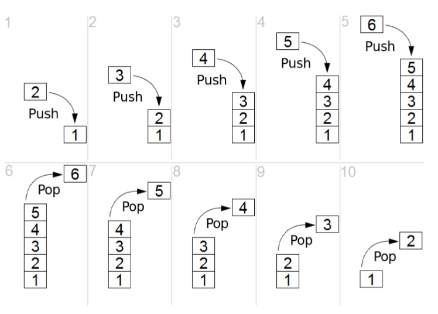
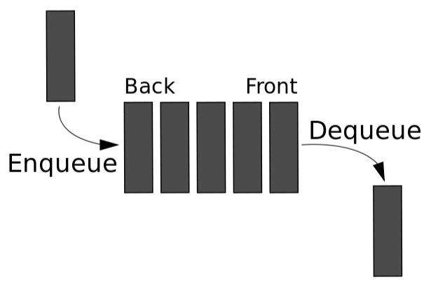

<a href="https://github.com/jhlee225/studyDevRepo">뒤로가기</a>

## Stack

- 선형 자료구조
- Last In First Out (LIFO). 나중에 들어간 원소가 먼저 나온다.
- 호출 시 가장 위에 있는 녀석이 호출되는 구조이다.
- 항상 최신 데이터에 접근해야 하는 경우에 용이하다.
- 중간데이터에 접근이 불가하다.
- 데이터 삽입(push), 데이터 추출(pop)
- 배열과 리스트로 모두 구현 가능
- 큐 - 그래프 - 깊이 우선 탐색(DFS)

## Queue

- 선형 자료구조
- First In First Out (FIFO). 먼저 들어간 놈이 먼저 나온다.
- 연결 리스트로 쉽게 구현 가능
- 순서대로 작업을 처리하고 싶을 때 (작업 대기열)
- 중간데이터에 접근이 불가하다.
- 큐 - 그래프 - 너비 우선 탐색(BFS)
